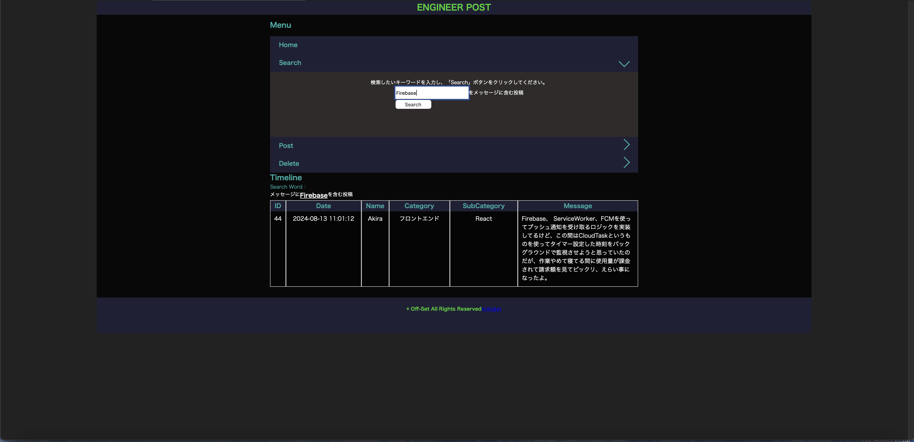
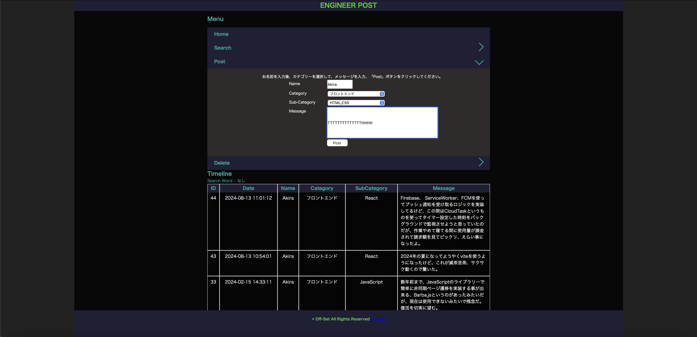

# Engineer-Post

エンジニア向けの掲示板アプリをPHP, JavaScriptで開発しました。

# アプリケーション

> 公開中: http://sakurazaka.s324.xrea.com/products-app/bbs.php

## 🔍 概要

自分自身の学習で躓いたりしたことや問題解決までのログを残せたらいいなと思い投稿をデータベースに記録して表示させる簡易的なウェブアプリを作ってみました。

## 工夫点

投稿をポストする際に、選択欄をAjaxを使ってoptionタグのカテゴリーを選択するとサブカテゴリーが連動して切り替わるように実装しました。

## 🛠️ 使用技術

| 種別           | 技術スタック       | 選定理由                                                                 |
|----------------|--------------------|--------------------------------------------------------------------------|
| 開発言語       | PHP / JavaScript   | PHPはサーバーサイド処理に広く使われており、学習コストが低く安定した運用が可能。JavaScriptはフロントエンドの動的なUI制御に不可欠で、Reactなどのライブラリとも親和性が高いため。 |
| データベース   | MySQL              | 世界中で広く使われているリレーショナルデータベースであり、構造化されたデータの管理に適しており、ドキュメントも豊富で導入が容易なため。 |

- スクリーンショットやGIF（UI紹介）

